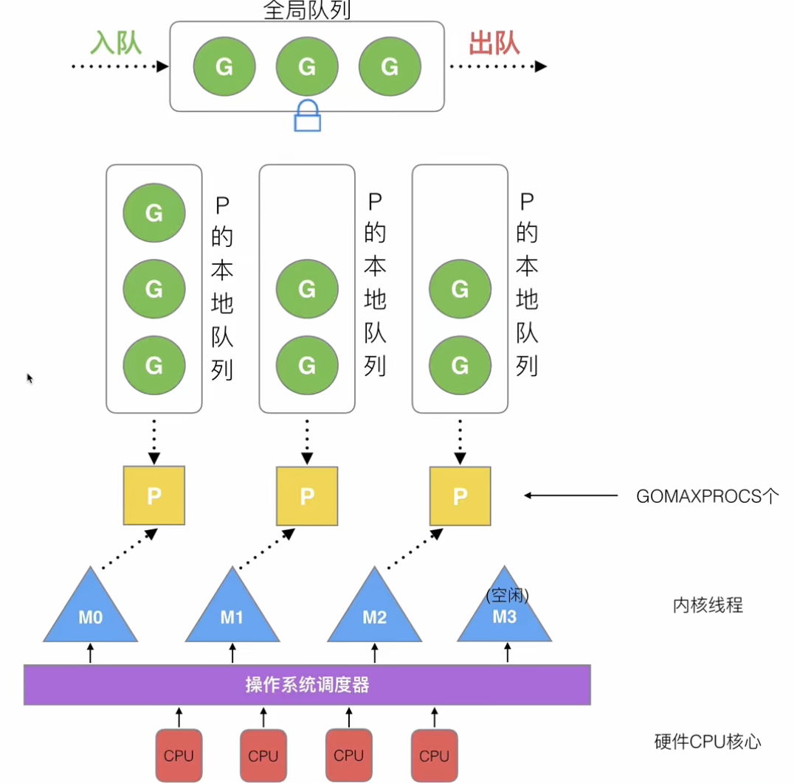

# golang调度器

## GMP模型
GMP这三个字母是什么？
G -> goroutine 协程
P -> processor 处理器
M -> thread 物理线程

这三个东西在runtime里面都是结构体，都有自己的定义的。

### M的事情
用户进程是由操作系统来调度的，一个进程什么时候获得CPU等资源，是由操作系统来决定的。这一层是OS的调度层，go语言的调度层是在这一层上面的细粒度的调度层，要注意区分这两个调度。

这里的M说是线程，实际上在linux下面还是可以理解为进程，这都无关紧要。
M是在程序开始运行的时候自动创建的，数量是可以配置的，跟硬件有关，不同的go版本也不完全一样。

### P到底是干啥的？
P是处理器，协程就是一段代码，只有到了P上面才能执行起来，也就是说，P的任务就是获取G来执行它们的。
那么P从哪里获取G来执行呢？
有两个地方，一个就是每个P都有一个自己的本地队列，除此之外还有一个全局队列，这些队列里面的都是等待被执行的协程G。

P的本地队列里面的协程是有一定的数量限制的。
优先将新创建的G放到本地队列中，如果满了，就放到全局队列中。

P在程序启动的时候，自动创建的，runtime里面。

### G对应协程
一个G协程一般对应一个要 `go func() { ... }` 的一个函数，这个函数就是一个协程任务。