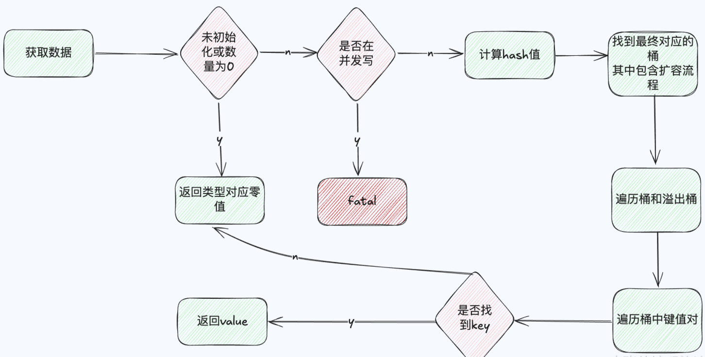

# go 的 map

Go 语言中的 map 是一种内建的数据结构，用来保存键值型数据。
```go
func main() {
	m := map[string]string{
		"巴西":"巴西利亚",
		"澳大利亚":"堪培拉",
		"加拿大":"渥太华"
	}
}
```
键值对API只是一套接口，实现方式可以有多种，例如java中的HashMap、TreeMap，python的dict也是使用哈希表实现。

## map 的 key
map是保存键值对的，他的键key必须是可以用==比较的类型，chan，map，func是不可比较的，那么切片，数组可以比较吗？

### 可以作为 key 的类型
基本数据类型，大都可以当做键
```go
package main

import "fmt"

func main() {
	// 整数作为键
	mapInt := map[int]string{
		1: "one",
		2: "two",
		3: "three",
	}
	fmt.Printf("mapInt: %v\n", mapInt)

	// 字符串作为键
	m1 := map[string]int{"one": 1, "two": 2}
	fmt.Printf("m1: %v\n", m1)

	// 浮点数作为键（不推荐，因为浮点数的比较可能会因精度问题导致不准确）
	m2 := map[float64]bool{1.2: false, 3.14: true}
	fmt.Printf("m2: %v\n", m2)

	// 数组类型作为键，因为数组是长度固定的，可以比较两个数组是否相等
	m3 := make(map[[2]int]string, 4)
	m3[[...]int{1, 2}] = "array1"
	m3[[2]int{9, 7}] = "array2"
	fmt.Printf("m3: %v\n", m3)
	a := [3]int{2, 3, 4}
	b := [3]int{2, 3, 4}
	equal := a == b
	fmt.Printf("equal: %v\n", equal)

	// 布尔值作为键
	mapBool := map[bool]string{
		true:  "true",
		false: "false",
	}
	fmt.Printf("mapBool: %v\n", mapBool)
}

/* output
mapInt: map[1:one 2:two 3:three]
m1: map[one:1 two:2]
m2: map[1.2:false 3.14:true]
m3: map[[1 2]:array1 [9 7]:array2]
equal: true
mapBool: map[false:false true:true]
*/

```
尤其是数组类型，也是可比较的类型，也可以当做键。
在python中，list是个unhashable的，是不能当做dict的键的
```python
Python 3.12.0 (main, Sep  5 2024, 19:03:31) [Clang 15.0.0 (clang-1500.3.9.4)] on darwin
Type "help", "copyright", "credits" or "license" for more information.
>>> d = {}
>>> d[[1,2,3]] = 1
Traceback (most recent call last):
  File "<stdin>", line 1, in <module>
TypeError: unhashable type: 'list'
>>> 
```
指针类型也是可以当做键的，接口类型也是可以当做键的（待补充代码）

### 不能作为map的键的类型
以下类型不能作为 map 的键：

- 切片类型，因为切片是引用类型，其内容可能会变化，使得比较操作不确定。
- 函数类型，因为 Go 语言中没有为函数定义相等性比较操作。
- map 类型，map 类型不能作为 map 的键，因为也是引用类型，且没有定义相等性比较操作。
- 包含上述不可比较类型的复合类型，任何包含上述不可比较类型（如切片、函数、映射）的复合类型结构体，也不能作为 map 的键。

### best practice
实际开发中，最好不要用哪些当键？[最佳实践](https://zhuanlan.zhihu.com/p/677134644)

## map 的创建、初始化

map只声明不赋值的话，是 `nil`

### 使用 make 创建
```go
m := make(map[string]int, 10) // 容量参考值10，实际不一定分配恰好10
```
### 直接赋值初始化
```go
m := map[string]int{"a": 1, "b": 2, "c": 3} 
```

## 访问 map
根据键拿值
```go
value := m["key"]
```
访问只声明，未分配的map会怎样？
```go
func var_map_without_assignment() {
	var m map[int]string // 声明但不赋值
	res := m[1]
	fmt.Printf("res: %v\n", res)

	// m[1] = "asuka" // panic: assignment to entry in nil map
	fmt.Printf("m: %v\n", m) // 这里并不会报错
}
```

试图访问map中不存在的键会怎样

这两个问题，都能在图中得到回答


### 默认返回零值
Go的map是引用类型，并且是无序的。如果你尝试访问一个不存在的键，你将得到该类型的零值（例如，对于整数类型是0，对于字符串类型是""）。以下是Go中使用map的一个例子：

```golang
package main

import "fmt"

func main() {
    m := map[string]int{
        "apple": 1,
        "banana": 2,
    }

    // 访问存在的键
    fmt.Println(m["apple"]) // 输出: 1

    // 访问不存在的键，将得到int类型的零值0
    fmt.Println(m["orange"]) // 输出: 0
}
```
### 和python defaultdict的相似和不同

在go中，你甚至可以对map里不存在的键进行运算
```go
package main

import "fmt"


func main() {
	m := map[int]int{1: 2, 3: 9}
	fmt.Printf("m[5]: %v\n", m[5]) // m[5]: 0

	// 对于不存在于m的键，你甚至可以对它进行++操作
	m[4]++
	fmt.Printf("m: %v\n", m) // m: map[1:2 3:9 4:1]

	
	// 可以检查 某个元素是否存在于map中
	if val, exist := m[8]; exist {
		fmt.Println("8存在", val)
		} else {
			fmt.Println("8不存在") // 执行这一行
		}
		
	var sz = len(m)
	fmt.Printf("sz: %v\n", sz)
	// 此时可以 m[8]++, 然后8就存在了
	m[8]++
	if val, exist := m[8]; exist {
		fmt.Println("8存在", val) // 执行这一行
	} else {
		fmt.Println("8不存在") 
	}

	sz = len(m)
	fmt.Printf("sz: %v\n", sz)
}
```

## 原理与实现

Go 语言中的 map 是通过哈希表 (hash table) 实现的。它提供了快速的键值对存储、查找、插入和删除功能。为了深入理解 map 的底层实现，我们需要探讨几个关键的概念：哈希函数、哈希桶、键冲突处理、扩容机制
[map的原理](https://blog.csdn.net/luozong2689/article/details/141684428)

go 中的 map 实际是 hmap 的 结构体，hmap 保存一些 哈希表的 信息

count 字段表示 已经存储的键值对的数目。
buckets 是指向桶数组的指针，桶是一些保存键值对的。
一个桶就是一个bmap结构体，一个桶能保存8个键值对。
一个bmap结构体里面有三个字段 tophash keys values。
实际的键值对，就是保存在bmap里面。

### 哈希函数

哈希函数，能够根据 键key 计算出一个数字，对应一个桶的编号，也就是hmap的buckets字段（bmap数组）的某一个元素（这个元素能存8个键值对，现在正在处理的是一个键值对）。

### 哈希桶
将冲突的键值对存储在同一个桶中。
8个键值对可以存在一个桶里面。
如果更多溢出了，就通过溢出桶 (overflow buckets) 来继续存储更多的键值对。


### 哈希冲突
哈希冲突是通过 链地址法 解决。
### 插入操作
### 扩容机制

 map 中的键值对数量增多，导致哈希冲突频繁发生时，Go 的 map 会触发扩容机制：
 扩容的时机是，当（哈希因子）达到某个特定的值，似乎是6.5？

 渐进式扩容：扩容时，map 会重新分配一个更大的哈希桶数组（通常是当前大小的两倍）。原有的键值对会逐步搬移到新的桶中。每次插入、删除或查找操作时，都会触发一些键值对的迁移，直到整个迁移过程完成。
再哈希：在扩容过程中，map 会重新计算键的哈希值，并将它们分配到新的桶中。这一过程有助于减少冲突，优化查找效率。

这里涉及到旧桶 新桶的问题。