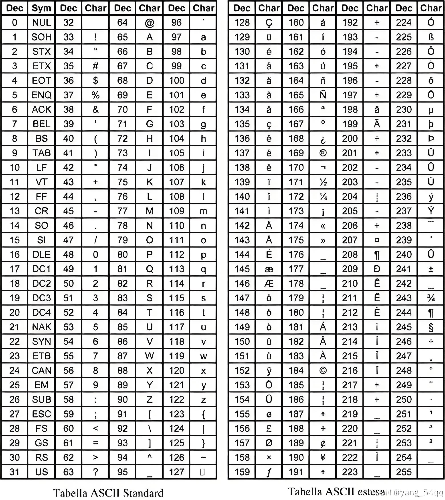

# 数据在计算机内的存储
计算机的硬盘和RAM都只能保存比特0和1，但是实际的信息种类很多：整数、浮点数、字符... 那么要如何保存这些内容呢？唯一的办法就是把建立规则，把这些内容映射为比特0和1的组合。

## ascii

ascii就是实现了上面的映射的一个规则，只不过，他只考虑了英文的常见符号和字符。



ascii保存了0-127编号的128个字符，只需要一个字节1byte(8bit) 就能表示一个英文字符。
保存字符到计算机时，只需要转换为01序列即可，解码的时候，也只需要按照字节拆分、查表翻译回字符即可。

## Unicode标准

unicode是一种标准，简单来讲，就是把世界上的一切符号，都对应一个唯一编码。

### No character, but grapheme

在unicode中，不再使用“字符”这样的字眼，因为在英文中，一个最小的单元显然是一个字母，但是在中文中，最小的单元是一个字，你不能降这二者都称为char？

在英文中，为了组成一个单词，你可能需要多个字母，例如`cat`需要c，a，t三个字母。
在现代汉语里面，`自行车` 这个词语需要三个字，自，行，车来构成。

我们的unicode编码，实际上就是在对这种构成`word`的最小单位进行编号，而这种最小单位，就被称为grapheme。

### unicode 码点

code point 又是什么？
有些字符可以对应一个code point，有的则可以对应两个，例如👍🏻对应一个黄色的👍，和一个白色块。

### unicode 编码策略

unicode是一种标准，那么怎么对这个标准进行编码？有多个标准，例如utf8, utf16等。

#### utf32 定长编码
使用4字节的定长编码，把所有的代码点都编码为4个字节，32位。
utf32的优点是所有字符，无论常见和罕见，都编码成为相同长度的二进制串，这对于编码和解码十分方便。
缺点是浪费内存。

#### utf8 变长编码
utf8是变长编码，不同范围的代码点，对应的编码长度不一样，兼容ascii。
例如一个汉字，编码之后是三个字节。

## utf8 编码汉字

一个汉字在utf8中，经过编码，长度是三个字节，这是为什么？
原因是在unicode编码标准中，中文汉字的编码范围正好落在 三字节编码的范围内。


可以使用[在线工具](https://www.metools.info/code/utf8235.html#google_vignette)进行编码
例如对 “你” 进行编码，结果是 E4BDA0，这是十六进制 对应的二进制是 11100100 10111101 10100000
是三字节。
第一个字节的前面4位是1110，后面两个字节的前两位都是10，这是规定好的。

`1110[0100] 10[111101] 10[100000]`
被中括号包围的 4 + 6 + 6 = 16位拼起来，就是`0100111101100000`
20320 对应的 就是汉字 你
在python中可以用ord函数得到字符对应的unicode码值（十进制）
```python
>>> s = "你"
>>> ord(s)
20320
```

也可以在go语言中验证
```go
// utf8_.go
package main

import (
	"fmt"
	"unicode/utf8"
)

func main() {
	s := "你6"
	l := len(s)
	fmt.Printf("l: %v\n", l) // 应该是4
	rn := utf8.RuneCountInString(s)
	fmt.Printf("rn: %v\n", rn)
	for i := range l {
		fmt.Printf("%b \n", s[i])
	}
}
```
注意这里可以看到，go语言中的rune。
```shell
❯ go run utf8_.go
l: 4
rn: 2
11100100 
10111101 
10100000 
110110 # 这个是第二个 rune 也就是 6 这个字符，在 ascii 范围内
```

再来看下下面的例子，就能知道 rune 实际上就是 utf8 的代码点。
```go
package main

import (
	"fmt"
	"unicode/utf8"
)

func main() {
	s := "你6"
	l := len(s)
	fmt.Printf("l: %v\n", l) // 应该是4
	rn := utf8.RuneCountInString(s)
	fmt.Printf("rn: %v\n", rn)
	for i := range l {
		fmt.Printf("%b \n", s[i])
	}

	s1 := "👍🏻" // 这个就含有两个 unicode 代码点
	fmt.Printf("s1: %v\n", s1)
	l1 := len(s1)
	fmt.Printf("l1: %v\n", l1) // 8
	rn1 := utf8.RuneCountInString(s1) // 2
	fmt.Printf("rn1: %v\n", rn1)
}
```